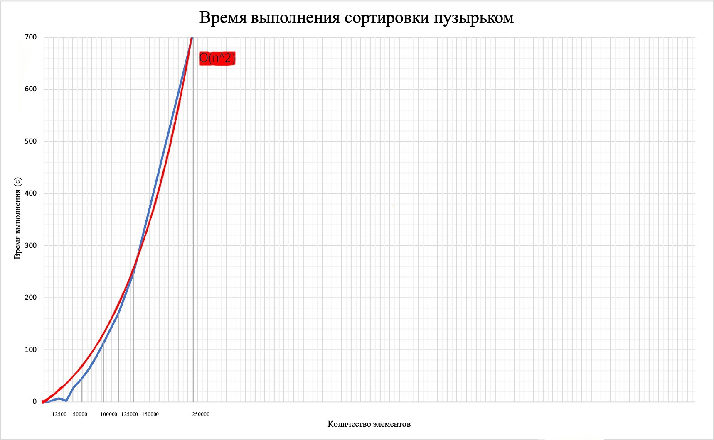
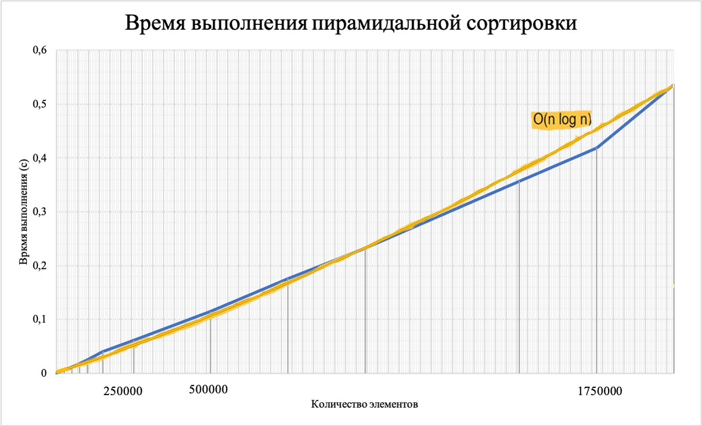

# Team homework on the subject "Functional Logic and Theory of Algorithms"
## *Bubble and Heap sorts*
### The purpose of the work:

> Investigation of the time complexity of sorting algorithms 
> in conditions of limited hardware resources

### The course of solving the team homework

The team task consisted of several stages: writing code, testing code, recording sorting times, 
plotting graphs and algorithmic schemes, as well as filling out a report and working with a presentation. 
During the homework, each of the team members was involved.

> Alice Maksimova - manager  
> David Bagdasarov - programmer  
> Nguyen Quang Hien - programmer  
> Evgeny Chelnokov - program tester  
> Anastasia Minasova - technical writer  

***
### *Bubble Sort*

Bubble sorting or sorting by simple exchanges is one of the quadratic array sorting algorithms. 
In terms of implementation and understanding, it is simple, but effective only for small arrays. 
Therefore, its time complexity is O(n^2)

This sorting method is practically not used in practice, but it underlies other more advanced ones, for example, fast and pyramidal.


*Bubble sorting code*
```c
	void Swap(int *a, int *b) {
  	int temp = *a;
  	*a = *b;
  	*b = temp;
	}

	void BubbleSort(int arr[], int n) {
  	int i, j;
  	bool swapped;
  	for (i = 0; i < n - 1; i++) {
    		swapped = false;
    		for (j = n - 1; j > i; j--)
      			if (arr[j] < arr[j - 1]) {
        			Swap( & arr[j], & arr[j - 1]);
        			swapped = true ;
      			}
      		if(swapped == false) 
      			break;
  	}
	}
```

***
### *Heap Sort*

Pyramid sorting or heap sorting is a sorting method based on such a data structure as a binary heap – a complete binary tree in which all elements are stored in a special order.

Pyramid sorting is one of the methods whose performance is estimated as O(n log(n)) 
The amount of service memory used does not depend on the size of the array O(1), which is a big plus. 
In all cases, its proven time complexity is O(n log(n))


*Heap sorting code*
```c
	void Swap(int *a, int *b) {
  	int temp = *a;
  	*a = *b;
  	*b = temp;
	}

	void Heapify(int arr[], int n, int i) {
  	int largest = i;
  	int left = 2 * i + 1;
  	int right = 2 * i + 2;
  	if (left < n && arr[left] > arr[largest])
    		largest = left;
  	if (right < n && arr[right] > arr[largest])
    		largest = right;
  	if (largest != i) {
    		Swap( & arr[i], & arr[largest]);
    		Heapify(arr, n, largest);
  	}
	}

	void HeapSort(int arr[], int n) {
  	int i;
  	for (i = n / 2 - 1; i >= 0; i--)
    		Heapify(arr, n, i);
  	for (i = n - 1; i >= 0; i--) {
    		Swap( & arr[0], & arr[i]);
    		Heapify(arr, i, 0);
  	}
	}
```

After writing the program code and testing it on a different number of elements of the sorted array, we built graphs of the time complexity of each of the sorting algorithms. 
They show that the discrepancy with the theoretical graphs is insignificant, each of the sorts coincides in time complexity with what we were supposed to get.

Number of elements | Bubble Sorting time (s)
--- | --- 
100 | 0.00000000000000000000000000000000000000000000000000
512 | 0.00700000000000000014571677198205179593060165643692
1000 | 0.01099999999999999936162176084053498925641179084778
1250 | 0.01600000000000000033306690738754696212708950042725
1500 | 0.02900000000000000147104550762833241606131196022034
1750 | 0.03200000000000000066613381477509392425417900085449
2000 | 0.04700000000000000011102230246251565404236316680908
2500 | 0.07499999999999999722444243843710864894092082977295
3000 | 0.10000000000000000555111512312578270211815834045410
4000 | 0.17699999999999999067412659314868506044149398803711
5000 | 0.27500000000000002220446049250313080847263336181641
6000 | 0.39700000000000001953992523340275511145591735839844
7500 | 0.62500000000000000000000000000000000000000000000000
10000 | 1.07699999999999995736743585439398884773254394531250
12500 | 1.75200000000000000177635683940025046467781066894531
25000 | 6.82200000000000006394884621840901672840118408203125
37500 | 15.69699999999999917577042651828378438949584960937500
50000 | 27.82000000000000028421709430404007434844970703125000
62500 | 42.97899999999999920419213594868779182434082031250000
75000 | 62.51400000000000289901436190120875835418701171875000
87500 | 86.03100000000000591171556152403354644775390625000000
100000 | 113.82599999999999340616341214627027511596679687500000
125000 | 170.49799999999999045030563138425350189208984375000000
150000 | 248.40100000000001045918907038867473602294921875000000
250000 | 709.41300000000001091393642127513885498046875000000000



Number of elements | Heap Sorting time (s)
--- | ---
100 | 0.00000000000000000000000000000000000000000000000000
1000 | 0.00100000000000000002081668171172168513294309377670
2500 | 0.00200000000000000004163336342344337026588618755341
5000 | 0.00400000000000000008326672684688674053177237510681
7500 | 0.01000000000000000020816681711721685132943093776703
10000 | 0.01299999999999999940325512426397835952229797840118
25000 | 0.02699999999999999969468866822808195138350129127502
50000 | 0.05800000000000000294209101525666483212262392044067
75000 | 0.08999999999999999666933092612453037872910499572754
100000 | 0.13600000000000000976996261670137755572795867919922
250000 | 0.33700000000000002176037128265306819230318069458008
500000 | 0.69599999999999995203836533619323745369911193847656
750000 | 1.09400000000000008348877145181177183985710144042969
1000000 | 1.50800000000000000710542735760100185871124267578125
1250000 | 1.92599999999999993427479694219073280692100524902344
1500000 | 2.35499999999999998223643160599749535322189331054688
1750000 | 2.86100000000000020961010704922955483198165893554688
2000000 | 3.31999999999999984012788445397745817899703979492188
2250000 | 3.75899999999999989697130331478547304868698120117188
2500000 | 4.21900000000000030553337637684307992458343505859375
2750000 | 4.65700000000000002842170943040400743484497070312500
3000000 | 5.11300000000000043343106881366111338138580322265625
3250000 | 5.57399999999999984368059813277795910835266113281250
3500000 | 6.00600000000000022737367544323205947875976562500000
4000000 | 6.94700000000000006394884621840901672840118408203125
5000000 | 8.86599999999999965893948683515191078186035156250000
7500000 | 13.54599999999999937472239253111183643341064453125000
10000000 | 18.72899999999999920419213594868779182434082031250000
20000000 | 38.99799999999999755573298898525536060333251953125000

